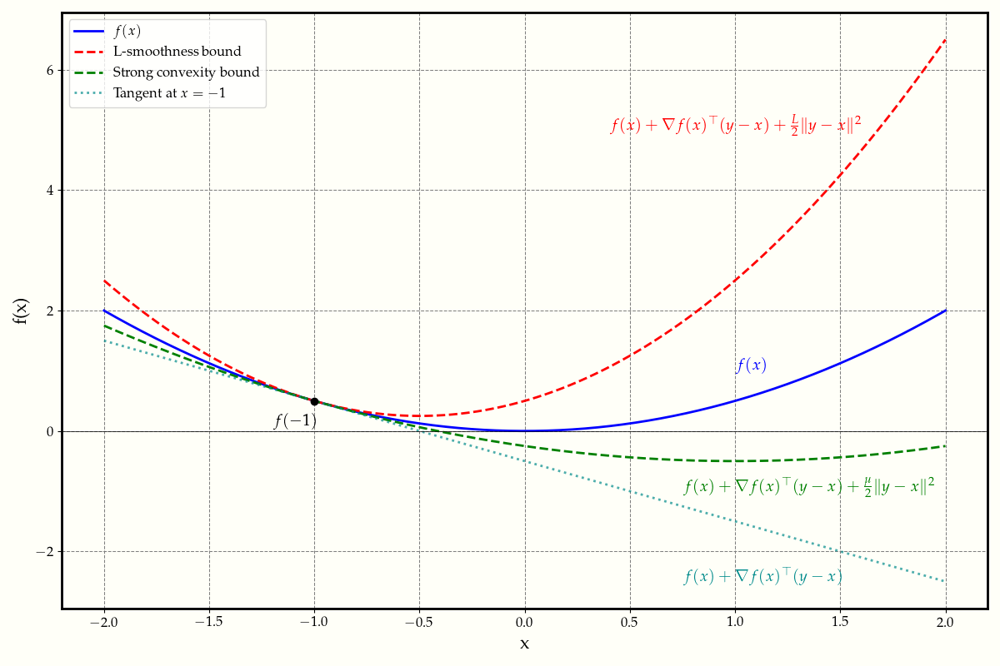

In this cheatsheet, we discuss the concepts of convexity, smoothness, and strong convexity, which are essential in the analysis of optimization algorithms.

Define a function $f: \text{dom}(f)\rightarrow \mathbb{R}$ with $\text{dom}(f) \subseteq \mathbb{R}^d$.
We assume that $f$ is differentiable, meaning that the gradient $\nabla f(x) \in \mathbb{R}^d$ exists $\forall x \in \text{dom}(f)$.

    <figure>
        
        <figcaption> Figure 1. Smoothness and strong convexity play complementary roles in bounding the function values. </figcaption>
    </figure>

## 1. Convexity

**(a) Definition.**
A function $f$ is convex if its domain is a convex set and if for all $x, y \in \text{dom}(f)$ and $\theta \in [0, 1]$, we have

$$
f(\theta x + (1-\theta)y) \leq \theta f(x) + (1-\theta)f(y)
$$

This definition is also known as the Jensen's inequality.
Oftentimes, it is more convenient to work with one of the following equivalent definitions:

**(b) First-order characterization.**
$$f(y) \geq f(x) + \nabla \langle f(x), y-x \rangle$$

**(c) Second-order characterization.**
Suppose that $f$ is twice differentiable.
A function $f$ is convex if its domain is a convex set and if for all $x \in \text{dom}(f)$, we have

$$
\nabla^2 f(x) \succeq 0
$$

where $\nabla^2 f(x)$ is the Hessian matrix of $f$ at $x$.

**(d) Monotonicity of the gradient.**
A function $f$ is convex if its domain is a convex set and if for all $x, y \in \text{dom}(f)$, we have

$$
\langle \nabla f(y) - \nabla f(x), y-x \rangle \geq 0
$$

## 2. Smooth functions

**(a) Definition.**
Let $X\subseteq \text{dom}(f)$ be a convex set and let $L > 0$. A function $f$ is $L$-smooth on $X$ if for all $x, y \in X$, we have

$$
f(y) \leq f(x) + \langle \nabla f(x), y-x \rangle + \frac{L}{2}\|y-x\|^2
$$

One can think of this definition as Lipschitz continuity of the gradient map.
Alternatively, we can use the following equivalent definition:

**(b)** (Lipschitz continuity of the gradient)
$$\| f(x) - \nabla f(y)\| \leq L\| x-y\|$$ for all $$x, y \in X$$.

**(c)**
$$g(x) = \frac{L}{2} x^\top x - f(x)$$ is convex.

**(d)**
$$\langle \nabla f(x) - \nabla f(y), x-y \rangle \leq L\|x-y\|^2$$ for all $$x, y \in X$$.

We have the following relations:

$$
    [b] \Rightarrow [a] \Leftrightarrow [c] \Leftrightarrow [d]
$$

If $f$ is additionally convex, then $$[a] \Rightarrow [b]$$.

## 3. Strong convexity

**(a) Definition.**
Let $X\subseteq \text{dom}(f)$ be a convex set and let $\mu > 0$. A function $f$ is $\mu$-strongly convex on $X$ if for all $x, y \in X$, we have

$$
f(y) \geq f(x) + \langle \nabla f(x), y-x \rangle + \frac{\mu}{2}\|y-x\|^2
$$

The notion of strong convexity is the opposite of smoothness.
Strong convexity implies that the function grows at least quadratically.
Moreover, $f$ is strongly convex implies that $f$ is strictly convex and has a unique minimizer.
Alternatively, we can use the following equivalent definition:

**(b)**
$$\| f(x) - \nabla f(y)\| \geq \mu\| x-y\|$$ for all $$x, y \in X$$.

**(c)**
$$g(x) = f(x) - \frac{\mu}{2} x^\top x$$ is convex.

**(d)**
$$\langle \nabla f(x) - \nabla f(y), x-y \rangle \geq \mu\|x-y\|^2$$ for all $$x, y \in X$$.

The relations are as follows:

$$
    [b] \Leftarrow [a] \Leftrightarrow [c] \Leftrightarrow [d]
$$

Figure 1 above illustrates the complementary roles of smoothness and strong convexity in bounding the function values.