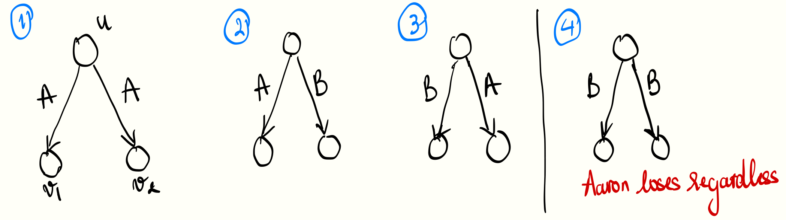
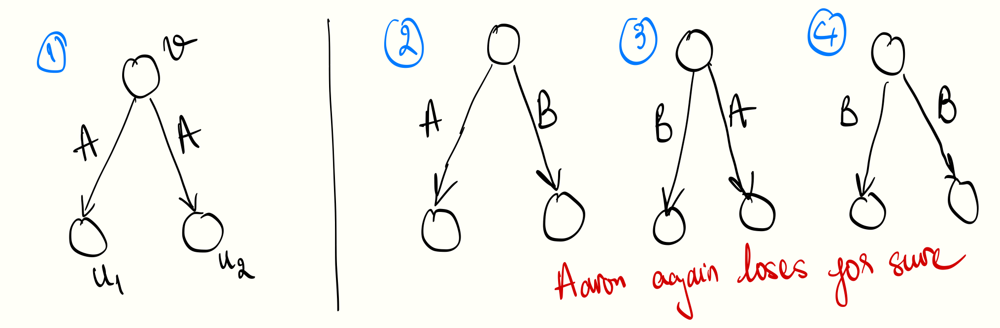

<!-- Personal remarks -->
I decided to slack off my exam studying with Jane Street's puzzle.
I first read the problem in early August, forgot about it, and then submitted my answer on August 16—and got it right on the first try! (username: Khanh Vu).
This month’s puzzle involves straightforward state analysis with a nice probability garnish.

## The problem

Aaron and Beren play a game on an infinite complete binary tree where each edge is independently labeled as $$\mathrm{A}$$ with probability $$p$$ and $$\mathrm{B}$$ otherwise.
The game starts with Aaron at the root, and the players take turns moving a shared token down the tree.
On each turn, the active player chooses one of the two child nodes to move the token to.
If the token traverses an edge labeled B, Beren wins; otherwise, Aaron wins.

The goal is to find the [infimum](https://en.wikipedia.org/wiki/Infimum_and_supremum) of all probabilities $$p$$ for which Aaron has a nonzero probability of winning. 
<!-- This infimum represents the smallest probability $$p$$ at which Aaron’s chance of winning is not zero, considering that Beren can choose a path that includes at least one edge labeled B. -->

You can read the full problem statement here at: [www.janestreet.com/puzzles/current-puzzle/](https://www.janestreet.com/puzzles/current-puzzle/).

## My approach

But, what does it mean for Aaron to win?
The universe that Aaron and Beren reside in is controlled by a demon (?).
This demon loves upside down binary trees, so it generates an infinite number of binary trees out of boredom.
Among these trees, if there exists a tree that allows Aaron to keep playing indefinitely, then we say that he wins with non-zero probability.

The demon grows a tree in the following fashion:
A tree starts with a root, and at each time step, every leaf node grows two child nodes.
The edges connecting each parent to its children are labeled $$\mathrm{A}$$ with probability $$p$$, and $$\mathrm{B}$$ otherwise.
As $$p$$ gets closer to $$1$$, it is more likely for Aaron to win.
So it makes sense that the problem asks for some sort of a lower bound for such $$p$$.

    <figure>
        
        <figcaption> <em>Figure 1. When it's Aaron turn, there are four scenarios.</em> </figcaption>
    </figure>

We can zoom in and examine the local picture.
Assuming that it's Aaron turn and the token is at a node $$u$$, the only state that makes him lose immediately is when the two edges are labeled $$(\mathrm{B}, \mathrm{B})$$ (state $$4$$ in Figure $$1$$).
Otherwise, he moves the token down to the child node $$v_1$$ or $$v_2$$, depending on the prospect of the two options (or it is possible at all to move the token to $$v_i$$ if the edge is labeled $$\mathrm{B}$$).

    <figure>
        
        <figcaption> <em>Figure 2. When it's Beren turn, only the first state allows the game to continue.</em> </figcaption>
    </figure>

When the token is in Beren's control, Aaron's only chance of winning is if both edges are labeled $$(\mathrm{A}, \mathrm{A})$$. 
In any other case, Beren wins by moving the token along the edge labeled $$\mathrm{B}$$.

Formally, let $$w_u$$ be the event that Aaron wins if he starts his turn at node $$u$$.
Now, node $$u$$ has children $$v_1$$ and $$v_2$$.
Let $$w_{v_1}$$ be the event that Aaron wins if it's Beren's turn and the token is at node $$v_1$$, and similarly, let $$w_{v_2}$$ represent the event that Aaron wins if it's Beren's turn and the token is at node $$v_2$$.
Then, we have the following recursive relation:

$$
\begin{align}
    \mathbb{P}(w_u) &= p^2 \cdot \mathbb{P}(w_{v_1} \lor w_{v_2}) + p(1-p)\cdot\mathbb{P}(w_{v_1}) + (1-p)p\cdot\mathbb{P}(w_{v_2}) &\text{(1)} \\
    \mathbb{P}(w_v) &= p^2 \cdot \mathbb{P}(w_{u_1} \land w_{u_2}) = p^2 \cdot \mathbb{P}(w_u)^2 &\text{(2)} 
\end{align}
$$

Eq. (2) used the fact that $$w_{u_1}$$ and $$w_{u_2}$$ are independent events.
From the sum rule of probability, we know that:

$$
\newcommand{\ind}{\perp\!\!\!\!\perp} 
\begin{align}
    \mathbb{P}(w_{v_1} \lor w_{v_2}) &= \mathbb{P}(w_{v_1}) + \mathbb{P}(w_{v_2}) - \mathbb{P}(w_{v_1} \land w_{v_2}) \\
    &= 2\mathbb{P}(w_v) - \mathbb{P}(w_v)^2 &(\text{since $w_{v_1} \ind w_{v_2}$})
\end{align}
$$

For brevity, let $$x:= \mathbb{P}(w_u)$$.
Combining the fact above and plugging (2) into (1), we arrive at the following identity:

$$
\begin{align}
    x &= 2x^2p^3 - x^4p^6
\end{align}
$$

Let the left-hand side be defined as $$f(x) := x$$ and the right-hand side as $$g(x) := 2x^2p^3 - x^4p^6$$. 
The game has just started on a fresh tree (the demon grows this tree as the game goes) so it's Aaron turn and the token is located at the root $$u$$.
The problem now is to find a value $$p_0 \in (0, 1)$$ such that for all $$p > p_0$$, the function $$f(x)$$ intersects with $$g(x)$$ at some $$x:=\mathbb{P}(w_u) > 0$$.
[Solving for $$p_0$$](https://www.wolframalpha.com/input?i=x+%3D+2x%5E2p%5E3+-+x%5E4p%5E3+%3E+0), we get $$\boxed{\frac{\sqrt{3}}{2^{5/6}}}\approx 0.972$$.

