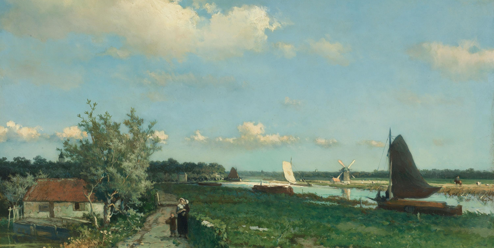

A friend of mine asked me why I think mathematics is beautiful.
I believe the exact answer does not matter, but it is important to have an answer.

Years ago, I visited the Rijksmuseum in Amsterdam---it is one of the biggest museums in the Northern European region.
In my memories, there was something _beautiful_ about the Dutch oil paintings from three centuries ago.
The composition is simple and direct, usually composed of a natural landscape under a light blue sky and cotton-like clouds.

    <figure>
        
        <figcaption><small>"View near the Geest Bridge" by Johan Hendrik Weissenbruch (1824–1903), oil on panel, 1868.</small></figcaption>
    </figure>

There is nothing particularly profound about these kinds of paintings, and they were not meant to showcase how skillful the painters who painted them were.
But the paintings spoke to me, they was telling me that the appreciation for being present in the moment is a universal human experience.
Our lives always move forward and are filled with uncertainties, but the beauty of this world, this reality is always there, waiting for us to notice it.
It is easy to find nothing in everything, but it takes effort to find everything in nothing.

Like arts, mathematics reveals a dimension of us.
In my early years of education, mathematics is usually portrayed as a strictly logical and rigorous discipline.
It was taught as if mathematics is an absolute truth, and the only way to understand it is to follow the rules.
However, the more I study mathematics, the more I realize that mathematics is just a vehicle for our mind to explore the unknown, and it is allowed to be imperfect and [incomplete](https://en.wikipedia.org/wiki/G%C3%B6del%27s_incompleteness_theorems).
Throughout the history of mathematics, we evolved our understanding as a collective, [old flaws](https://en.wikipedia.org/wiki/Banach%E2%80%93Tarski_paradox) were [patched](https://en.wikipedia.org/wiki/Measurable_space), and [new ones](https://en.wikipedia.org/wiki/Continuum_hypothesis) were discovered.
It is reflection that, in the end, we are all human beings, we are all struggling to make sense of this reality.
This realization is what makes mathematics beautiful to me.
<!-- It also changes the way I approach mathematics, I always try to push the boundaries of my intuition and my mental representation of mathematical objects, and leave the rigor to the end.  -->